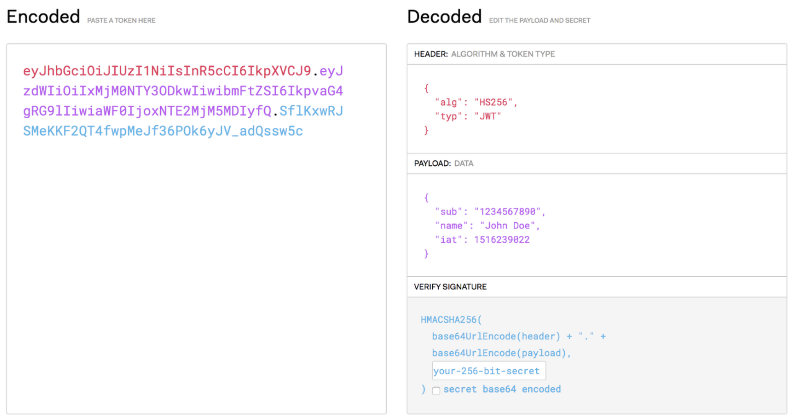

# JWT Authentication
**JWT(Json Web Token)** 은 토큰 기반 인증 방식으로, 서버가 사용자의 세션 상태를 저장하는 게 아니라, 필요한 정보를 토큰 body에 저장해 사용자가 가지고 있고 그것을 증명서 처럼 사용(**Stateless**). 사용자는 Access Token(JWT Token)을 **헤더**에 실어 서버로 보냄.

## 1. 특징
---
토큰은 **Header, Payload, Verifiy Signature**로 구성됨.
1. Header
    * Header, Payload, Verify Signature 정보를 암호화할 방식(alg), 타입(type)등이 들어감.
    * 토큰의 유형이나 HMAC-SHA256 또는 RSA와 같이 사용되는 해시 알고리즘이 무엇으로 사용됬는지 등의 정보가 담김.

2. Payload
    * 서버에서 보낼 데이터가 들어감. 일반적으로 사용자의 **ID, 유효기간**이 포함.
    * 클라이언트에 대한정보, META data같은 내용이 들어있고, Base64로 인코딩 되어있음.
3. Verify Signature
    * Base64 방식으로 인코딩한 Header, payload 그리고 SECRET KEY를 더한 후 서명됨.

위 내용을 가진 최종적인 형태는 Encoded Header, Encoded Paylaod, Verify Signature(xxxx.yyyy.zzzz) 임.

Header와 payload는 base64로 인코딩만 되므로 누구나 디코딩 하여 확인 가능. 따라서 payload에는 중요한 정보가 포함되면 안됨. verify signature는 Secret Key를 알지 못하면 복호화 할 수 없음.

## 2. JWT 인증방식 단계
---
1. 클라이언트가 로그인을 위해 해당 정보를 서버에 전달.
2. 서버에서는 전달된 데이터로 사용자를 확인하고 사용자의 고유한 ID값을 부여한 후, 기타 필요한 정보와 함께 Payload에 추가.
3. JWT 토큰의 유효기간을 설정.
4. 암호화할 SECRET KEY를 이용해 Access Token을 발급.
5. 사용자는 Access Token을 받아 저장한 후, 인증이 필요한 요청마다 토큰을 헤더에 추가하여 전달.
6. 서버에서는 해당 토큰의 Verify Signature를 SECRET KEY로 복호화 한 후, 조작 여부, 유효기간을 확인.
7. 해당 토큰이 유효하면 Payload를 디코딩하여 사용자의 ID에 맞는 데이터를 호출.
## 2. 장, 단점
---
1. 장점
    * JWT는 발급한 후 노큰 검증만 하면 되기 때문에 추가 저장소가 필요 없음.
    * 서버를 확장하거나 유지, 보수하는데 유리.
    * 토큰 기반으로 하는 다른 인증 시스템에 접근이 가능.
2. 단점 
    * 세션/쿠키의 경우 세션ID가 변질되었다고 판단되면 해당하는 세션을 지우면 되지만 JWT는 한번 발급되면 유효기간이 완료될 때 까지는 계속 사용이 가능하므로 유효기간이 지나기 전까지 정보들을 탈취할 수 있음.
    * Payload 정보가 제한적 Payload는 따로 암호화되지 않기 때문에 디코딩하면 누구나 정보를 확인할 수 있어서 담는 데이터가 제한적임.
    * 세션/쿠키 방식에 비해 JWT의 길이가 기므로 인증이 필요한 요청이 많아질수록 서버의 자원낭비가 발생.
    * 유효기간을 짧게 하면 재로그인 시도가 잦아지고 길면 해커에게 탈취될 가능성이 큼.

## 3. 단점 보완 - Refresh Token
---
기존의 Access Token의 유효기간을 짧게 하고 **Refresh Token**이라는 새로운 토큰을 발급하면 Access Token을 탈취당해도 상대적으로 피해를 줄일 수 있음.

* Refesh Token은 Access Token과 똑같은 형태의 JWT임. 로그인이 완료됐을 때, Access Token 과 동시에 Refresh Token은 긴 유효기간을 갖고 발행되고 Access Token의 유효기간이 만료되었을 때 새로 Token을 발급해주는 열쇠가 필요함.

* Refresh Token의 유효기간이 만료되면 사용자는 새로 로그인해야 하고, Access Token과 동일하게 Refresh Token도 탈취될 가능성이 있기 때문에 적절한 유효기간 설정이 필요함.
## 4. Refresh Token이 포함된 JWT 인증방식 단계
---
1. 클라이언트가 로그인을 위해 해당 정보를 서버에 전달.
2. 서버에서는 전달된 데이터로 사용자를 확인하고 사용자의 고유한 ID값을 부여한 후, 기타 필요한 정보와 함께 Payload에 추가.
3. JWT 토큰의 유효기간을 설정
4. 암호화할 SECRET KEY를 이용해 Access Token, **Refresh Token**을 발급.(일반적으로 회원 DB에 Refresh Token을 저장)
5. 사용자는 Refresh Token을 안전한 저장소에 저장.
6. 사용자는 Access Token을 받아 저장(쿠키).
한 후, 인증이 필요한 요청마다 토큰을 헤더에 추가하여 전달.
7. 시간이 지나 Access Token이 만료되었다고 가정.
8. 사용자는 6번과 같은 방식으로 Access Token을 헤더에 담아 서버에 요청.
9. 서버는 Access Token이 만료된 것을 확인하고 사용자에게 만료 메세지를 반환.
    * 사용자는 Access Token의 Payload를 통해 유효기간을 알 수 있으므로 요청 이전에 바로 재발급 요청을 할 수 있음
10. 사용자는 Refresh Token과 Access Token을 헤더를 담아 서버에 요청
11. 서버는 요청받은 토큰의 Verify Signature를 SECRET KEY로 복호화한 후, 조작 여부, 유효기간을 확인하고 전달받은 Refresh Token과 저장해둔 Refresh Token을 비교, Token이 동일하고 유효기간이 지나지 않았다면 Access Token 발급
12. 사용자는 새로 발급받은 Access Token을 저장하여 인증이 필요한 요청마다 토큰을 헤더에 추가하여 전달

=> Access Token이 있을 때보다 안전. but, 구현이 복잡, Access Token이 만료될 때마다 새롭게 발급하는 과정에서 생기는 HTTP 요청이 잦음.

## 5. Reference
https://brownbears.tistory.com/440